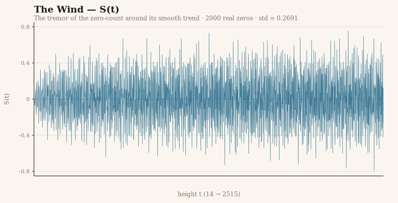
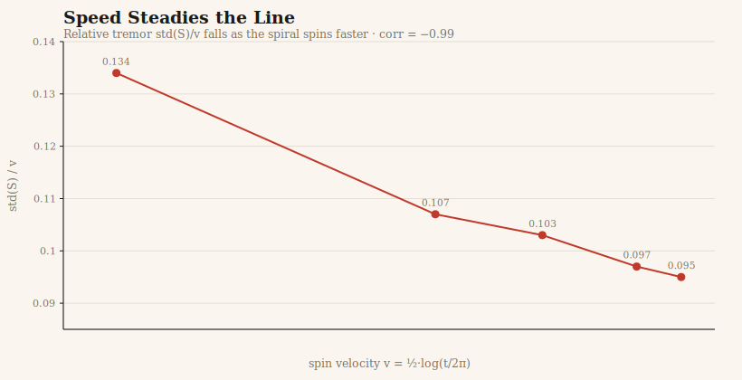
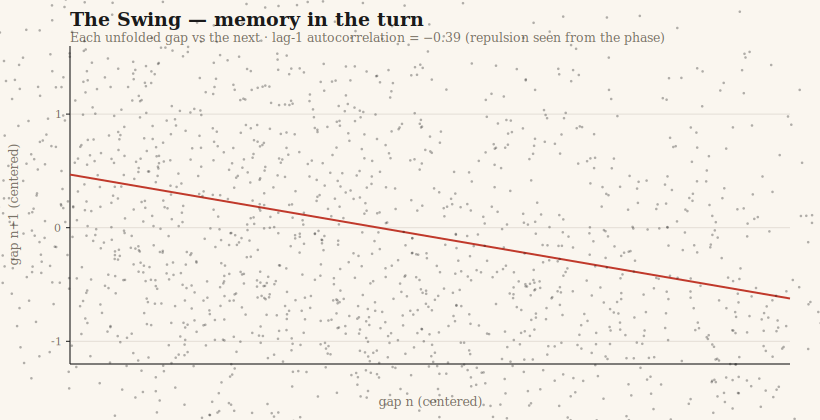
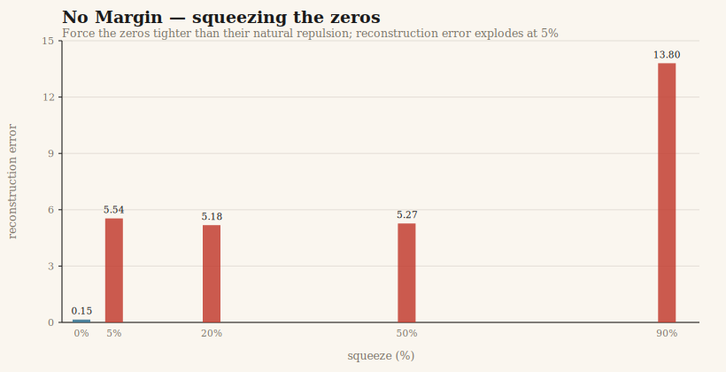

# Riemann Windows

### Twenty-seven windows onto the zeros of the Riemann zeta function — another way to see them, for students and for anyone who finds the usual path too steep.

> **Read this first.** This is **not** a proof of the Riemann Hypothesis. It contains **nothing new** and nothing unknown to mathematicians. It is something smaller, and I hope more useful: a way *into* the theory of the prime numbers through the door of everyday intuition — every metaphor checked, byte-exact, against 2000 real zeros of the zeta function. Where an idea failed, the failure is left in the building where you can see it. The honesty is the whole point.

---

## What this is

The prime numbers — 2, 3, 5, 7, 11 … — are the atoms of arithmetic. They look scattered, but they hide an order, and in 1859 Bernhard Riemann found that this order is governed by a set of special numbers called the **zeros** of his zeta function. The **Riemann Hypothesis** says they all lie on a single line. It has stood unproven for over 160 years.

I am a psychologist and a lorry driver, not a mathematician. I cannot read the proof literature, and I am not trying to. What I *can* do is think in pictures from ordinary life — a car's differential, a hospital's backup generator, a jet's bow shockwave, twins separated at birth — and have those pictures translated into algebra and run through a numerical **wind tunnel** that either confirms them or kills them on the spot.

Over many hours, more than twenty of these metaphors turned out to be **the same object seen from different angles**. That object is **S(t)**: the tremor of the zero-count around its smooth trend. *The wind.* Everything else in this collection is S(t) transformed.

None of the windows shows anything undiscovered. They all open onto **known** structure — the GUE statistics, the Hardy–Littlewood circle method, the Prime Number Theorem, Riemann's explicit formula. But a window is for looking through. Someone may lean on one at a different hour and see something I could not.

## What is inside

- **`Twenty-Seven_Windows.md`** — the full document: 27 windows, two side-tunnels (the Antikythera mechanism; the Siegel "orphan screw"), and every refuted metaphor recorded with its signed, significant failure.
- **`Twenty-Seven_Windows.pdf`** — the same, typeset for reading.
- **`chart_wind.svg`, `chart_speed.svg`, `chart_swing.svg`, `chart_rigidity.svg`** — four figures drawn from the real data (see below).
- **`riemann_zeros_2000.txt`** — the 2000 zero heights this work is built on.
- **`gen_zeros.py`, `analyze.py`, `make_charts.py`** — the scripts that compute the zeros and the figures, so anyone can reproduce every number.

## The figures (all from real data)

Each figure traces to a measured number in the document — nothing is decorative.

**The Wind — S(t).** The tremor of the zero-count around its smooth trend, across all 2000 zeros. Standard deviation **0.2691**; it grows extraordinarily slowly with height (Selberg's signature) — never runaway, never calm.



**Speed Steadies the Line.** As the function spins faster up the critical line, the tremor *relative* to the spin keeps shrinking — correlation **−0.99**. The spiral steadies itself by accelerating.



**The Swing.** Each gap between zeros, plotted against the next: a clear downward tilt (lag-1 autocorrelation **−0.39**). The zeros repel — a turn that overshoots winds back to keep the mean. Repulsion, seen from the phase.



**No Margin.** Force the zeros tighter than their natural repulsion allows and the reconstruction of the primes shatters — a mere 5% squeeze multiplies the error 36×, and it is already broken; squeezing further barely changes it. The zeros have no slack: their positions are exact-or-nothing. (A visceral view of the rigidity of the explicit formula.)



## The method, in one line

> Numbers from files only. Metric = audit. Nothing invented.

2000 non-trivial zeros of ζ(s), heights **14.13 → 2515.29**, computed from the zeta function itself by the Riemann–Siegel method (mpmath, 25 digits). Every metaphor that survived became a window; every one that failed is recorded *as* a failure, with its sign and its significance. One especially seductive result — a perfect **+1.0000** correlation that looked, for a heartbeat, like a discovery — turned out to be a coding artefact, was caught before it was believed, and is written up in full. *The discipline that catches your own false +1.000 is the same discipline that would let you trust a real one.*

## The verdict, unperfumed

All twenty-seven windows open onto the same courtyard. Wind, spiral, ratchet, prime-wave, self-steadying velocity, the trapdoor, the backup generator, the fuses — they are not twenty-seven phenomena. They are one object: the zeros and the primes, which the explicit formula shows are a single thing seen twice, from below and from above. Intuition saw them as one before the notation split them into chapters.

This does not prove or disprove anything. The Hypothesis lives in terrain no computation reaches — *"the half-sheet of paper."* What this is, is an honest pedagogical vein: a way to enter the theory of the zeros through intuition, with the real numbers under every metaphor. Verifiable. Reproducible. And told, I hope, as no one has quite told it.

If it helps one student understand the primes a little better — that is enough.

## Reproduce it

```bash
pip install mpmath numpy
python3 gen_zeros.py        # writes riemann_zeros_2000.txt (a few minutes)
python3 analyze.py          # verifies the headline numbers
python3 make_charts.py      # redraws the four figures
```

## Citing / using

This is shared freely. If it is useful to you, use it. It rests entirely on the work of the mathematicians who actually built this theory — Riemann, Selberg, Montgomery, Dyson, Hardy and Littlewood, Odlyzko, and many others; the metaphors are only a set of windows cut into their building.

**Rafael Amichis Luengo** · Madrid, 2026 ·

*A note on the name: "the Architect" is a name some AI systems took to calling me while we worked. I keep it with affection, not as a title I gave myself. 
